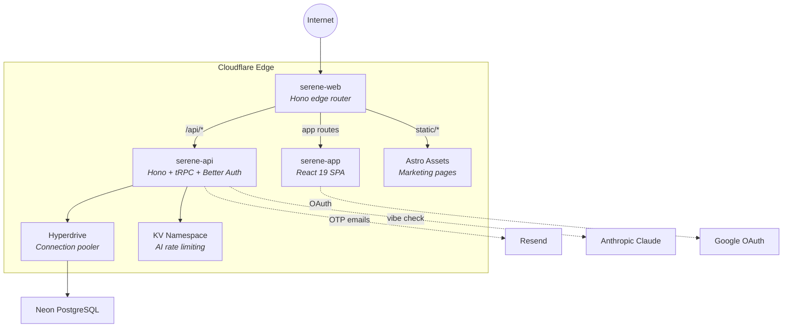

# Serene -- AI-Powered Mental Wellness Journal

A private, AI-powered wellness journal that helps you track your mood, reflect on your day, and receive gentle encouragement -- all in under 60 seconds.

**Live:** [serene.linktalentsbot.work](https://serene.linktalentsbot.work)

## Features

- **Mood journaling** -- Log how you feel with six intuitive mood options and contextual tags
- **AI Vibe Check** -- Receive warm, empathetic responses powered by Claude after each entry
- **Weekly analytics** -- Visual mood trends, distributions, and tag correlation insights
- **Privacy-first** -- Your journal entries are yours; no data shared with third parties
- **Calm aesthetic** -- Sage green and warm ivory palette designed for daily wellbeing
- **Crisis support** -- Automatic detection surfaces helpline resources when needed

## Tech Stack

| Layer        | Technologies                                                 |
| ------------ | ------------------------------------------------------------ |
| **Runtime**  | Bun, Cloudflare Workers, TypeScript 5.9                      |
| **Frontend** | React 19, TanStack Router, Tailwind CSS v4, shadcn/ui, Jotai |
| **Backend**  | Hono, tRPC 11, Better Auth (email OTP, Google OAuth)         |
| **Database** | Drizzle ORM, Neon PostgreSQL, Cloudflare Hyperdrive          |
| **AI**       | Anthropic Claude for empathetic journal responses            |
| **Email**    | React Email, Resend                                          |
| **Infra**    | Cloudflare Workers, Terraform, Wrangler CLI                  |

## Architecture



Three Cloudflare Workers connected via [service bindings](https://developers.cloudflare.com/workers/runtime-apis/bindings/service-bindings/) (no public cross-worker URLs). The web worker is the only public-facing endpoint -- it routes all traffic internally.

For detailed architecture documentation, see [docs/architecture/overview.md](docs/architecture/overview.md).

## Quick Start

### Prerequisites

- [Bun](https://bun.sh/) v1.3+
- [Docker](https://www.docker.com/) (for local PostgreSQL)
- [just](https://github.com/casey/just) (task runner, optional -- shell scripts provided as alternative)

### Local Development

```bash
# Clone and install
git clone <your-repo-url>
cd serene
bun install

# Configure environment
cp .env.example .env.local
# Edit .env.local with your credentials (DATABASE_URL, BETTER_AUTH_SECRET, etc.)

# Start everything (Docker DB + dev servers)
just start

# Without just installed:
./scripts/start-dev.sh      # Start DB + dev servers
./scripts/stop-dev.sh       # Stop everything
```

### Docker (Full Stack)

```bash
just docker-start
```

### Local Ports

| Port | Service                  | URL                   |
| ---- | ------------------------ | --------------------- |
| 5173 | App (SPA) -- Vite dev    | http://localhost:5173 |
| 8787 | API -- Hono server       | http://localhost:8787 |
| 4321 | Web -- Astro edge router | http://localhost:4321 |
| 5434 | PostgreSQL (Docker)      | --                    |

### Dev Auth (Auto-Login)

In development mode, email OTP login is fully automatic -- no manual code entry needed:

- The API returns the OTP in the response body (`devOtp` field) and logs it to the server console.
- The frontend auto-fills and auto-submits the OTP code.
- Any email address works (e.g., `test@test.com`) -- the email OTP flow auto-creates accounts.
- Email delivery is not required (Resend errors are swallowed in dev).

**Note:** Auto-login is dev-only. Production requires manual OTP entry via email.

## Environment Variables

| Variable               | Required | Description                                           |
| ---------------------- | -------- | ----------------------------------------------------- |
| `DATABASE_URL`         | Yes      | PostgreSQL connection string                          |
| `BETTER_AUTH_SECRET`   | Yes      | Session signing secret (`openssl rand -hex 32`)       |
| `GOOGLE_CLIENT_ID`     | Yes\*    | Google OAuth client ID                                |
| `GOOGLE_CLIENT_SECRET` | Yes\*    | Google OAuth client secret                            |
| `RESEND_API_KEY`       | No       | Resend API key for transactional emails               |
| `ANTHROPIC_API_KEY`    | No       | Anthropic API key (AI vibe check disabled without it) |

\* Required by the API worker's Zod schema (`apps/api/lib/env.ts`). The worker crashes on startup without them.

Copy `.env.example` to `.env.local` and fill in real credentials. `.env.local` is git-ignored.

## Development Commands

```bash
# Task runner
just start              # Docker DB + native dev servers
just stop               # Stop everything
just dev                # Tmux session with separate windows per service
just check-all          # Tests + typecheck + lint + format

# Bun scripts
bun dev                 # Start all dev servers concurrently
bun run build           # Build all workspaces (email → web → api → app)
bun run test            # Run tests (watch mode)
bun run test --run      # Run tests once
bun lint                # ESLint with cache
bun typecheck           # TypeScript type checking
bun db:push             # Push schema to database
bun db:seed             # Seed development data
bun db:studio           # Open Drizzle Studio (database GUI)
bun ui:add <component>  # Add shadcn/ui component
```

## Deployment

Serene deploys as three Cloudflare Workers backed by Neon PostgreSQL via Hyperdrive.

```bash
just deploy-prod        # Build + deploy all workers to production
```

See the [deployment guide](docs/deployment/serene-deployment-guide.md) for full step-by-step instructions and the [infrastructure reference](docs/deployment/serene-infrastructure-reference.md) for Terraform details.

## Project Structure

```
serene/
├── apps/
│   ├── web/            Hono edge router (public entry, service bindings)
│   ├── app/            React 19 SPA (TanStack Router, Tailwind, shadcn/ui)
│   ├── api/            Hono + tRPC API (Better Auth, Drizzle, AI vibe check)
│   └── email/          React Email templates (@repo/email)
├── packages/
│   ├── ui/             shadcn/ui components (new-york style)
│   ├── core/           Shared types and utilities
│   └── ws-protocol/    WebSocket protocol definitions
├── db/                 Drizzle ORM schemas, migrations, seed data
├── infra/              Terraform (Cloudflare Workers, Hyperdrive, DNS)
├── docs/               Documentation and architecture decision records
│   ├── architecture/   System architecture docs
│   ├── deployment/     Deployment and infrastructure guides
│   └── adr/            Architecture decision records
└── ai_review/          Bowser QA user story tests
```

## Documentation

| Document                                                                       | Description                                      |
| ------------------------------------------------------------------------------ | ------------------------------------------------ |
| [Architecture Overview](docs/architecture/overview.md)                         | System design, request flow, component breakdown |
| [Deployment Guide](docs/deployment/serene-deployment-guide.md)                 | Step-by-step production deployment               |
| [Infrastructure Reference](docs/deployment/serene-infrastructure-reference.md) | Terraform, Cloudflare, and DNS configuration     |
| [Auth Hint Cookie (ADR-001)](docs/adr/001-auth-hint-cookie.md)                 | Why the web worker uses a cookie for routing     |

## License

This source code is licensed under the MIT license found in the [LICENSE](LICENSE) file.
