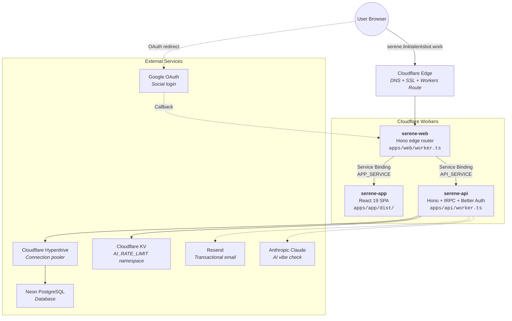
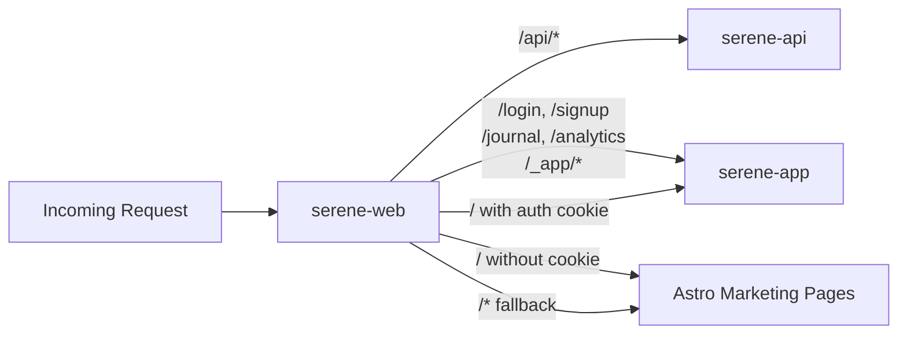
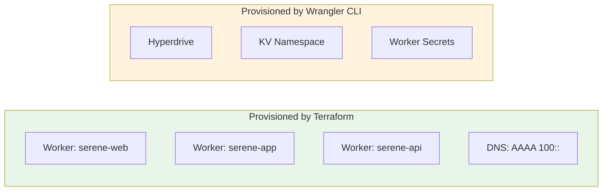
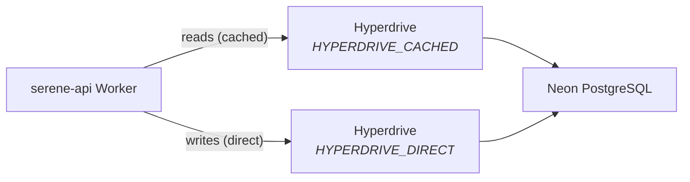
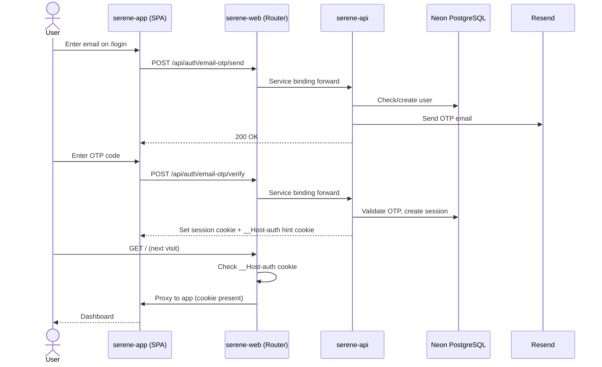
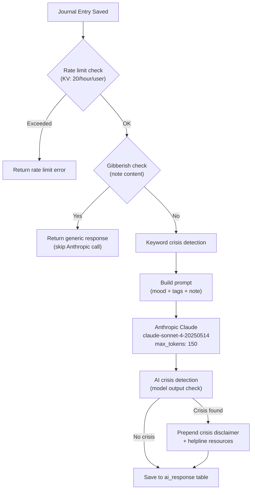
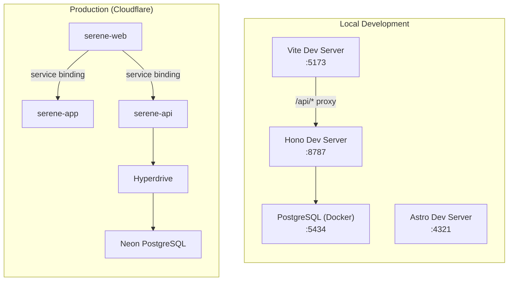
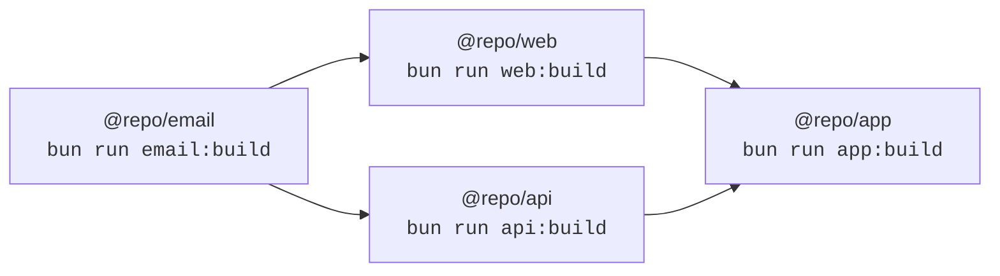
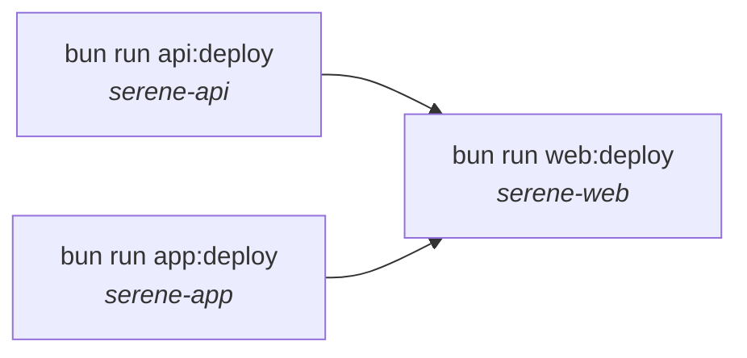

# Serene Architecture Overview

How the system works in local development and production.

---

## Production Architecture

Serene runs as three Cloudflare Workers connected via service bindings. Only the web worker has a public route -- the app and API workers are internal.



### Request Routing

Every request to `serene.linktalentsbot.work` hits the web worker first. It routes based on URL path:



The home page (`/`) is special -- it checks for a `__Host-auth` hint cookie:

- **Cookie present**: user is likely authenticated, proxy to app worker (shows dashboard)
- **No cookie**: serve the static Astro marketing landing page

This avoids an unnecessary redirect for returning users. See [ADR-001](../adr/001-auth-hint-cookie.md) for the design rationale.

---

## Worker Responsibilities

### serene-web (Edge Router)

| What          | Details                                         |
| ------------- | ----------------------------------------------- |
| Entry point   | `apps/web/worker.ts`                            |
| Framework     | Hono (minimal router)                           |
| Public route  | `serene.linktalentsbot.work/*`                  |
| Role          | Routes traffic to app/api via service bindings  |
| Static assets | Astro-built marketing pages in `apps/web/dist/` |
| Constraints   | No `nodejs_compat` -- must stay lightweight     |

### serene-app (SPA)

| What         | Details                                             |
| ------------ | --------------------------------------------------- |
| Entry point  | `apps/app/dist/index.html` (assets-only worker)     |
| Framework    | React 19, TanStack Router, Tailwind CSS v4          |
| Public route | None (internal via service binding)                 |
| Role         | Serves the single-page application                  |
| Routing      | Client-side via TanStack Router (file-based)        |
| 404 handling | `single-page-application` mode returns `index.html` |

### serene-api (Backend)

| What         | Details                                           |
| ------------ | ------------------------------------------------- |
| Entry point  | `apps/api/worker.ts`                              |
| Framework    | Hono + tRPC 11                                    |
| Public route | None (internal via service binding)               |
| Auth         | Better Auth (email OTP + Google OAuth)            |
| Database     | Drizzle ORM via Hyperdrive → Neon PostgreSQL      |
| Email        | React Email templates sent via Resend             |
| AI           | Anthropic Claude streaming + rate limiting via KV |
| Compat flag  | `nodejs_compat` enabled                           |

---

## Cloudflare Infrastructure Components

### Why Each Component Exists



| Component      | Purpose                                                                                                                                                                                                     |
| -------------- | ----------------------------------------------------------------------------------------------------------------------------------------------------------------------------------------------------------- |
| **Workers**    | Run application code at the edge. Three workers isolate concerns (routing, SPA, API).                                                                                                                       |
| **Hyperdrive** | Connection pooler between Workers and Neon PostgreSQL. Workers create short-lived connections (`max: 1`) on each request -- Hyperdrive pools these efficiently. Required because Workers Paid plan ($5/mo). |
| **KV**         | Key-value store for AI rate limiting. Stores per-user hourly counters (`ratelimit:ai:{userId}:{hourBucket}`) with 2-hour TTL. Limits: 20 AI requests/hour/user.                                             |
| **DNS**        | AAAA record pointing to `100::` (IPv6 discard prefix). Cloudflare Workers routes intercept traffic before it reaches this placeholder -- the record just enables the proxied routing.                       |
| **Terraform**  | Infrastructure-as-code for workers and DNS. Creates resource metadata only -- code is deployed separately via Wrangler.                                                                                     |
| **Secrets**    | Sensitive values (`BETTER_AUTH_SECRET`, `RESEND_API_KEY`, `GOOGLE_CLIENT_ID/SECRET`, `ANTHROPIC_API_KEY`) set via `wrangler secret put`. Never in config files.                                             |

### Why Terraform + Wrangler (Not Just One)

Terraform manages **what exists** (worker names, DNS records). Wrangler manages **what runs** (code, routes, bindings). This split exists because:

1. Terraform creates worker metadata before any code is deployed
2. Wrangler deploys code and configures runtime bindings (Hyperdrive IDs, KV namespaces)
3. Hyperdrive cannot be created via API token (permission unavailable in Cloudflare UI) -- only Wrangler CLI with browser OAuth works

---

## Database Architecture



Two Drizzle instances per request:

| Instance   | Binding             | Use case                                          |
| ---------- | ------------------- | ------------------------------------------------- |
| `db`       | `HYPERDRIVE_CACHED` | Reads, list queries, `getById`                    |
| `dbDirect` | `HYPERDRIVE_DIRECT` | Writes, transactions, anything needing fresh data |

Both currently use the same Hyperdrive config (caching disabled). The separation is a naming convention for future read caching optimization.

**Connection settings:** `max: 1` (one connection per Worker instance), `prepare: false` (required for connection pooling compatibility).

### Schema

```mermaid
erDiagram
    user ||--o{ session : "has"
    user ||--o{ identity : "has"
    user ||--o{ journal_entry : "writes"
    journal_entry ||--o| ai_response : "generates"

    user {
        string id PK "usr_ prefix"
        string name
        string email UK
        boolean emailVerified
        string image
    }

    session {
        string id PK "ses_ prefix"
        string userId FK
        string token UK
        timestamp expiresAt
    }

    identity {
        string id PK "idn_ prefix"
        string userId FK
        string accountId
        string providerId
    }

    journal_entry {
        string id PK "jrn_ prefix"
        string userId FK
        string mood
        text[] tags
        text note
        timestamp createdAt
    }

    ai_response {
        string id PK "air_ prefix"
        string entryId FK UK
        text response
        boolean hasCrisisContent
        string model
    }
```

All IDs use prefixed CUID2 format (e.g., `usr_`, `jrn_`, `air_`). The `identity` table is Better Auth's `account` table renamed via `modelName`.

---

## Authentication Flow



The `__Host-auth` cookie is a **routing hint only** -- not a security boundary. The app worker validates the actual session via `beforeLoad` in TanStack Router, which calls `auth.api.getSession()` on every protected route.

---

## AI Vibe Check Pipeline



Two delivery modes:

- **tRPC mutation**: non-streaming, returns complete response
- **SSE endpoint** (`/api/ai/stream/:entryId`): streams tokens in real-time with 10-second timeout

---

## Local Development vs Production



| Aspect           | Local Development                        | Production                           |
| ---------------- | ---------------------------------------- | ------------------------------------ |
| Worker routing   | Vite proxy (`/api/*` → `:8787`)          | Cloudflare service bindings          |
| Database         | Docker PostgreSQL on `:5434`             | Neon via Hyperdrive                  |
| Auth cookies     | `auth` (HTTP, no prefix)                 | `__Host-auth` (HTTPS, Secure)        |
| OTP delivery     | Auto-injected in API response (`devOtp`) | Sent via Resend email                |
| AI rate limiting | Bypassed (KV unavailable locally)        | Enforced via KV namespace            |
| Entry point      | Three separate dev servers               | Single public URL, internal bindings |

---

## Build and Deploy Pipeline

### Build Order

Email templates must compile first because the API worker imports them:



Run `bun run build` to build all in the correct order.

### Deploy Order

API and app workers must exist before web (service bindings reference them by name):



Run `just deploy-prod` to build and deploy everything in one command.

### Full Deployment Process

For first-time setup, see the [Deployment Guide](../deployment/serene-deployment-guide.md). Summary:

1. **Phase 1**: Register third-party accounts (Cloudflare, Neon, Google, Resend, Anthropic)
2. **Phase 2**: Provision infrastructure (Terraform + Wrangler CLI for Hyperdrive/KV)
3. **Phase 3**: Configure workers (update Hyperdrive/KV IDs, set secrets)
4. **Phase 4**: Push database schema (`bun db:push`)
5. **Phase 5**: Build and deploy (`just deploy-prod`)
6. **Phase 6**: Verify (health checks, auth flow, Google OAuth)

---

## Key Design Decisions

| Decision                    | Rationale                                                                                       | Reference                                                    |
| --------------------------- | ----------------------------------------------------------------------------------------------- | ------------------------------------------------------------ |
| Three separate workers      | Isolation of concerns, independent scaling, minimal edge router                                 | --                                                           |
| Service bindings (no URLs)  | Zero-latency internal routing, no public API surface for internal workers                       | --                                                           |
| Auth hint cookie            | Web worker can't validate sessions (no DB access) -- uses lightweight cookie as routing hint    | [ADR-001](../adr/001-auth-hint-cookie.md)                    |
| Hyperdrive for DB           | Workers create short-lived connections -- Hyperdrive pools them efficiently                     | --                                                           |
| `prepare: false` in Drizzle | Required for connection pooling compatibility with Hyperdrive                                   | --                                                           |
| Prefixed CUID2 IDs          | Sortable, collision-resistant, human-readable prefix identifies table of origin                 | --                                                           |
| Terraform + Wrangler split  | Terraform for infrastructure metadata, Wrangler for code deployment (Hyperdrive permission gap) | [Deployment Guide](../deployment/serene-deployment-guide.md) |
